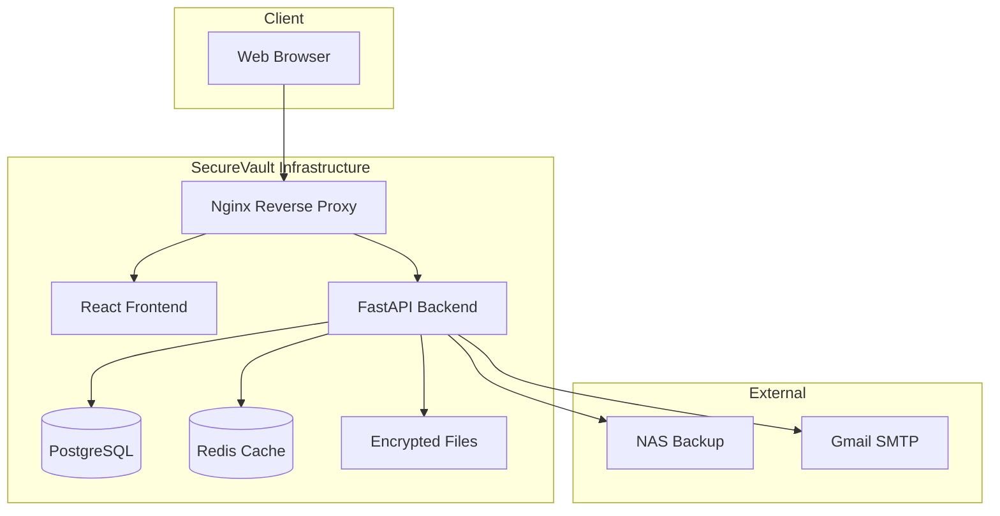

# SecureVault - Enterprise Document Storage

SecureVault is a microSaaS application providing enterprise-grade secure document storage for small teams (5-6 users). Built with security-first principles, it features client-side encryption, role-based access control, and optional on-premise backup capabilities.

## 🚀 Quick Start

### Prerequisites

- Docker 20.10+
- Docker Compose 2.0+
- 4GB RAM minimum
- 10GB disk space

### Development Setup

1. **Clone and setup**:
   ```bash
   git clone <repository-url>
   cd ai_docsafe
   cp .env.example .env
   ```

2. **Start development environment**:
   ```bash
   # Using the management script (recommended)
   ./scripts/infrastructure.sh start-dev
   
   # Or using docker-compose directly
   docker-compose up --build -d
   ```

3. **Access the application**:
   - Frontend: http://localhost:3000
   - Backend API: http://localhost:8000
   - API Documentation: http://localhost:8000/docs
   - Nginx Proxy: http://localhost:80

4. **Check service health**:
   ```bash
   ./scripts/infrastructure.sh health
   ```

### Production Deployment

1. **Configure environment**:
   ```bash
   cp .env.example .env
   # Edit .env with production values
   ```

2. **Deploy**:
   ```bash
   ./scripts/infrastructure.sh start-prod
   ```

## 🏗️ Architecture

### Technology Stack

- **Frontend**: React 18 + TypeScript + Vite
- **Backend**: Python FastAPI with async support
- **Database**: PostgreSQL 15 with SQLAlchemy ORM
- **Cache**: Redis for session management
- **Proxy**: Nginx reverse proxy
- **Containerization**: Docker with hot reload

### Security Features

- **Client-side Encryption**: AES-256-GCM via Web Crypto API
- **Zero-Knowledge**: Server never accesses unencrypted documents
- **Role-Based Access Control**: 5-tier RBAC system
- **Multi-Factor Authentication**: TOTP-based (Google Authenticator)
- **Audit Logging**: Comprehensive tamper-proof activity tracking
- **Key Management**: PBKDF2 with 100,000+ iterations

### Infrastructure



## 🛠️ Development

### Project Structure

```
├── backend/                 # Python FastAPI application
│   ├── app/                # Application code
│   ├── tests/              # Test suite
│   ├── Dockerfile          # Development container
│   └── Dockerfile.prod     # Production container
├── frontend/               # React TypeScript application
│   ├── src/                # Source code
│   ├── public/             # Static assets
│   ├── Dockerfile          # Development container
│   └── Dockerfile.prod     # Production container
├── nginx/                  # Nginx configuration
│   ├── nginx.conf          # Main configuration
│   └── conf.d/             # Server configurations
├── scripts/                # Management scripts
│   └── infrastructure.sh   # Infrastructure management
├── data/                   # Persistent data (development)
│   ├── files/              # Encrypted documents
│   ├── backups/            # Database backups
│   └── ssl/                # SSL certificates
├── docker-compose.yml      # Development orchestration
├── docker-compose.prod.yml # Production orchestration
└── .env                    # Environment configuration
```

### Available Commands

#### Infrastructure Management
```bash
# Start/stop services
./scripts/infrastructure.sh start-dev    # Start development environment
./scripts/infrastructure.sh start-prod   # Start production environment
./scripts/infrastructure.sh stop         # Stop all services
./scripts/infrastructure.sh restart-dev  # Restart development

# Monitoring
./scripts/infrastructure.sh health       # Check service health
./scripts/infrastructure.sh logs         # View all logs
./scripts/infrastructure.sh logs backend # View specific service logs

# Database operations
./scripts/infrastructure.sh backup-db    # Create database backup
./scripts/infrastructure.sh restore-db backup.sql # Restore from backup

# Cleanup
./scripts/infrastructure.sh clean        # Remove all containers/volumes
```

#### Backend Development
```bash
# Run tests
docker-compose run --rm backend pytest
docker-compose run --rm backend pytest --cov=app

# Code quality
docker-compose run --rm backend black .          # Format code
docker-compose run --rm backend ruff check .     # Lint code
docker-compose run --rm backend mypy app         # Type checking
docker-compose run --rm backend isort .          # Sort imports

# Security scanning
docker-compose run --rm backend bandit -r app    # Security scan
docker-compose run --rm backend safety check     # Dependency scan
```

#### Frontend Development
```bash
# Run tests
docker-compose run --rm frontend npm test
docker-compose run --rm frontend npm run test:coverage

# Code quality
docker-compose run --rm frontend npm run lint       # Lint code
docker-compose run --rm frontend npm run format     # Format code
docker-compose run --rm frontend npm run type-check # Type checking
```

### Development Workflow

1. **Make code changes** - Files are automatically mounted for hot reload
2. **Run tests** - Use the commands above to run specific test suites
3. **Check code quality** - Run linting and formatting tools
4. **Test integration** - Start the full stack and test end-to-end
5. **Review health** - Check service health before committing

## 🔧 Configuration

### Environment Variables

#### Development (.env)
```bash
# Database
POSTGRES_DB=securevault
POSTGRES_USER=securevault_user
POSTGRES_PASSWORD=dev_password

# Redis
REDIS_PASSWORD=dev_redis_password

# Application
SECRET_KEY=dev-secret-key-32-chars-minimum
ENVIRONMENT=development
CORS_ORIGINS=http://localhost:3000
```

#### Production (.env)
```bash
# Database
POSTGRES_DB=securevault
POSTGRES_USER=securevault_user
POSTGRES_PASSWORD=strong-production-password

# Redis
REDIS_PASSWORD=strong-redis-password

# Application
SECRET_KEY=strong-production-secret-key-32-chars-minimum
ENVIRONMENT=production
API_URL=https://your-domain.com/api
CORS_ORIGINS=https://your-domain.com

# Email (Gmail SMTP)
GMAIL_USERNAME=your-email@gmail.com
GMAIL_APP_PASSWORD=app-specific-password

# NAS Backup (Optional)
NAS_TYPE=nfs
NAS_HOST=your-nas-server
NAS_SHARE=/path/to/backup/location
```

### Service Configuration

#### Database
- PostgreSQL 15 with persistent volumes
- Automatic schema initialization
- Health checks with `pg_isready`
- Connection pooling support

#### Redis
- Persistent storage with AOF
- Password authentication
- Health checks with ping
- Session storage optimization

#### Nginx
- HTTP/2 support
- Rate limiting (API: 10r/s, Auth: 5r/m)
- Security headers (HSTS, CSP, etc.)
- Gzip compression
- Static asset caching

## 🔒 Security

### Security Features

1. **Client-Side Encryption**: All documents encrypted before leaving the browser
2. **Zero-Knowledge Architecture**: Server cannot decrypt user documents
3. **Role-Based Access Control**: 5-tier system (Super Admin → Viewer)
4. **Multi-Factor Authentication**: TOTP-based with backup codes
5. **Audit Logging**: All actions logged with tamper protection
6. **Secure Session Management**: Redis-based with JWT tokens
7. **Rate Limiting**: Protection against brute force attacks
8. **Input Validation**: Comprehensive validation and sanitization

### Security Headers

```nginx
Strict-Transport-Security: max-age=31536000; includeSubDomains
X-Frame-Options: SAMEORIGIN
X-Content-Type-Options: nosniff
X-XSS-Protection: 1; mode=block
Referrer-Policy: strict-origin-when-cross-origin
Content-Security-Policy: default-src 'self'; ...
```

### Encryption Details

- **Algorithm**: AES-256-GCM
- **Key Derivation**: PBKDF2 with 100,000+ iterations
- **Key Management**: Client-side with admin escrow option
- **File Processing**: Chunked encryption for large files
- **Backup Encryption**: Separate encryption for NAS backups

## 📊 Monitoring

### Health Checks

All services include comprehensive health checks:

- **Database**: Connection and query validation
- **Redis**: Ping response and memory usage
- **Backend**: HTTP endpoint with dependency checks
- **Frontend**: HTTP response and asset availability
- **Nginx**: Configuration validation

### Logging

Structured logging with different levels:

- **Application**: Business logic and user actions
- **Security**: Authentication, authorization, and security events
- **Performance**: Response times and resource usage
- **Error**: Exception handling and error tracking

### Metrics

Key metrics to monitor:

- **Response Times**: API endpoint performance
- **Error Rates**: Application and HTTP error rates
- **Resource Usage**: CPU, memory, and disk usage
- **Security Events**: Failed logins, permission violations
- **Storage Usage**: Document and backup storage consumption

## 🚀 Deployment

### Development Deployment

```bash
# Start with hot reload
./scripts/infrastructure.sh start-dev

# Check service health
./scripts/infrastructure.sh health

# View logs
./scripts/infrastructure.sh logs
```

### Production Deployment

```bash
# Configure environment
cp .env.example .env
# Edit .env with production values

# Deploy
./scripts/infrastructure.sh start-prod

# Verify deployment
./scripts/infrastructure.sh health
curl -f https://your-domain.com/api/health
```

### Docker Registry Deployment

```bash
# Build and tag images
docker build -t your-registry/securevault-backend:latest ./backend
docker build -t your-registry/securevault-frontend:latest ./frontend

# Push to registry
docker push your-registry/securevault-backend:latest
docker push your-registry/securevault-frontend:latest

# Deploy from registry
docker-compose -f docker-compose.prod.yml pull
docker-compose -f docker-compose.prod.yml up -d
```

## 🧪 Testing

### Backend Testing

```bash
# Unit tests
docker-compose run --rm backend pytest tests/unit/

# Integration tests
docker-compose run --rm backend pytest tests/integration/

# End-to-end tests
docker-compose run --rm backend pytest tests/e2e/

# Coverage report
docker-compose run --rm backend pytest --cov=app --cov-report=html
```

### Frontend Testing

```bash
# Unit tests
docker-compose run --rm frontend npm test

# Integration tests
docker-compose run --rm frontend npm run test:integration

# E2E tests (requires running backend)
docker-compose run --rm frontend npm run test:e2e

# Coverage report
docker-compose run --rm frontend npm run test:coverage
```

### Security Testing

```bash
# Backend security scan
docker-compose run --rm backend bandit -r app -f json

# Dependency vulnerability scan
docker-compose run --rm backend safety check

# Frontend dependency audit
docker-compose run --rm frontend npm audit

# Container security scan
docker run --rm -v /var/run/docker.sock:/var/run/docker.sock \
  aquasec/trivy image securevault_backend:latest
```

## 📚 API Documentation

### Interactive Documentation

- **Swagger UI**: http://localhost:8000/docs
- **ReDoc**: http://localhost:8000/redoc

### Authentication

```bash
# Login
curl -X POST "http://localhost:8000/auth/login" \
  -H "Content-Type: application/json" \
  -d '{"username": "user", "password": "password"}'

# Access protected endpoint
curl -H "Authorization: Bearer <token>" \
  "http://localhost:8000/api/documents"
```

## 🤝 Contributing

1. Fork the repository
2. Create a feature branch: `git checkout -b feature/amazing-feature`
3. Make changes and add tests
4. Run quality checks: `./scripts/infrastructure.sh health`
5. Commit changes: `git commit -m 'Add amazing feature'`
6. Push to branch: `git push origin feature/amazing-feature`
7. Open a Pull Request

### Code Standards

- **Backend**: Black formatting, Ruff linting, MyPy type checking
- **Frontend**: ESLint + Prettier, TypeScript strict mode
- **Testing**: Minimum 80% coverage for critical paths
- **Security**: All changes security reviewed
- **Documentation**: Update docs for public APIs

## 📄 License

This project is licensed under the MIT License. See LICENSE file for details.

## 🆘 Support

### Troubleshooting

**Services won't start:**
```bash
# Check Docker status
docker system info

# Check available resources
docker system df

# Clean up if needed
./scripts/infrastructure.sh clean
```

**Database connection issues:**
```bash
# Check database logs
./scripts/infrastructure.sh logs db

# Test database connection
docker-compose exec db pg_isready -U securevault_user -d securevault
```

**Frontend not loading:**
```bash
# Check frontend logs
./scripts/infrastructure.sh logs frontend

# Verify nginx configuration
docker-compose exec nginx nginx -t
```

### Getting Help

- **Documentation**: Check CLAUDE.md for detailed technical guidance
- **Issues**: Create GitHub issues for bugs and feature requests
- **Security**: For security issues, email security@securevault.local
- **Community**: Join our Discord server for community support

---

**SecureVault** - Secure Document Storage for Small Teams